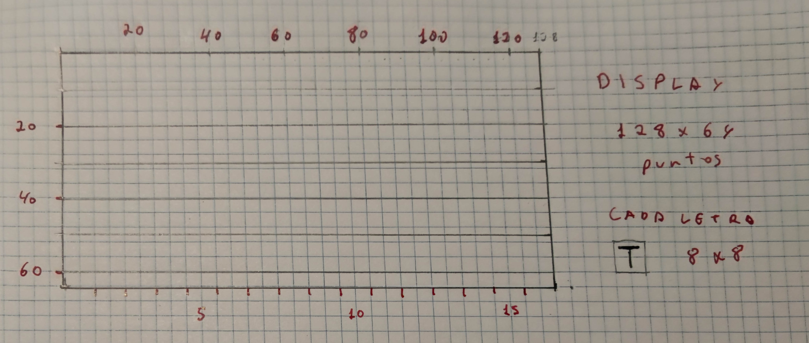

# 2526_CL7 (antes 2425CL11) uP: Conexión a internet con Pico W - revisado

Indice evolutivo del las clases del taller + libros y webs de referencia:

[GitHub - Jcspoza/2526_PyR_Index: Curso Programación y Robotica 2025 2026 - CMM BML](https://github.com/Jcspoza/2526_PyR_Index)

## Clase 7  (en 2425 Clase 11) - Indice - 90 minutos

- Tutoriales y Programas que vamos a seguir

- Introducción pedagógica

- Conectarse a WIFI : Entender y hacer el Tutorial de Sunfounder

- Usar la conexión de forma muy sencilla

## Tutoriales y Programas que vamos a seguir

### Tutoriales resumen

Los dos mejores tutoriales que he visto sobre conectar el PICO W al wifi son los dos indicados anteriormente, especialmente el de Sunfounder

De Sunfounder ( el tutorial de PICO W y el de PICO 2W son iguales)

[8.1 Access to the Network &mdash; SunFounder Kepler Kit for Raspberry Pi Pico W 1.0 documentation](https://docs.sunfounder.com/projects/kepler-kit/en/latest/pyproject/iotproject/1.access.html)

De Raspberry 

[Get-started-pico-w page 2](https://projects.raspberrypi.org/en/projects/get-started-pico-w/2)

Otros de interes

[Connecting to WiFi - Learning MicroPython](https://dmccreary.github.io/learning-micropython/wireless/02-connecting-to-wifi/)

[Conectarse a red WiFi con Raspberry Pi Pico W y MicroPython - Geek Factory](https://www.geekfactory.mx/tutoriales-raspberry-pi-pico/conectarse-a-red-wifi-con-raspberry-pi-pico-w-y-micropython/?srsltid=AfmBOop4xwHdGHCsQWK9-woI5ANhjHY3M7i9FjoTNbjdw4Mw_8TBYFXR)

Tutorial para 'Requests'

[Raspberry Pi Pico W: HTTP GET Requests (MicroPython) | Random Nerd Tutorials](https://randomnerdtutorials.com/raspberry-pi-pico-w-http-requests-micropython/)

Tutorial para tipo de datos JSON devuelto por la mayoría de los servidores

Ver tutorial [Python JSON Data: Una guía con ejemplos](https://www.datacamp.com/es/tutorial/json-data-python)

----

### Tabla resumen de programas

| Programa                                                         | Lenguaje | Objetivo de Aprendizaje                                             | Hw adicional   |
| ---------------------------------------------------------------- | -------- | ------------------------------------------------------------------- | -------------- |
| [BMMR_CL19s_wifi_connect_0_1.py](BMMR_CL19s_wifi_connect_0_1.py) | uPy      | NO usar - solo aprendizaje                                          | no solo PICO W |
| [BMMR_CL19s_wifi_connect_0_2.py](BMMR_CL19s_wifi_connect_0_2.py) | uPY      | NO usar - solo aprendizaje                                          | solo PICO W    |
| [BMMR_CL19s_wifi_connect_1_9.py](BMMR_CL19s_wifi_connect_1_9.py) | uPy      | Versión completa                                                    | solo PICO W    |
| [R_BHWT_wifi_connect_2_0.py](R_BHWT_wifi_connect_2_0.py)         | uPY      | Mejora sobre 1.9, añade flash de led                                | solo Pico W    |
| [R_BHWT_wifi_nastro_1_1.py](R_BHWT_wifi_nastro_1_1.py)           | uPy      | Test básico de uso de una API de tipo HTTP                          | Display SH1106 |
| [R_BHWT_wifi_nastro_2_0.py](R_BHWT_wifi_nastro_2_0.py)           | uPy      | Test básico de uso de una API de tipo HTTP + gestión  error de HTTP |                |

### Recomendaciones de estudio despues de la clase

Leer el [pdf](./2324_CL19_Wifi.pdf) con la explicación más competa de acceso a internet

## Introducción

### Pedagógica

En el curso de 2023- 2024 presente el tema de la conexiona internet en Python y PicoW de forma exhaustiva, y creo que este curso es mejor usar un enfoque mas directo. Asi que usare la CL19 de 2023, que he resumido en este[ pdf.](./2324_CL19_Wifi.pdf)

Lógicamente este enfoque hará facil empezar con proyectos prácticos , pero si los proyectos con complejos de vez en cuando habrá que contar la parte teórica que hemso obviado.

### Desde la práctica (actualizado)

Enseguida los montajes robóticos empiezan a ser "troceados" o dicho más correctamente **distribuidos** tanto física como en su parte de inteligencia. Veamos algunos ejemplos 

<u>Simples :</u>

* Mando a distancia simple:
  
  * por infrarrojos (IR) : coche robótico
  * por Radio(433Mhz) : mando de garaje

* Sensor remoto
  
  * Sensor de temperatura y humedad de una estación neteo casera (433Mhz)
  * Sensor de humedad de suelo

<u>Mas complejos:</u>

- Reloj de deporte : almacenamiento local -> analisis remoto en app ( conexión bluetooth)

- Estación meteorológica profesional (conexión internet)

- Control de dron

- .....

En estos, y otros casos, de **robot distribuido complejo**, la PICO W/2W es una buena opcion para la parte distribuida / remota, **comunicándose por WIFI** con un ordenador o una app de servidor.

### Introducción técnica super básica

Para usar las posibilidades de conexión la red internet de la PICO W necesitamos como minimo 2 pasos

1. Acceder a capa 4- Transporte ( de 7capas del modelo OSI) / o a la capa 3 Transporte del modelo antiguo de una 'pila'  TCP/IP  : Acceder a la red en modo TCP/IP ==> usamos network.WLAN
   
   El Pico W soporta comunicación wifi a 2.4 Ghz 802.11n. En MicroPython, usaremos una libreria construida 'sobre' una libreria mas basica llamada [lwip](https://savannah.nongnu.org/projects/lwip/)  que implementa  un TCP/IP stack ( no lo explicare): **es la libreria  [network](https://docs.micropython.org/en/latest/library/network.html#)**

2. Capa Aplicación: Usar un programa que maneje algun protocolo de aplicación como HTTP
   
   ( esto es igual que en un PC) 
   
   Por ejemplo, para HTTP usamos la libreria requests

---

## Conectarse a WIFI : Entender y hacer el Tutorial de Sunfounder

Seguir el [pdf.](./2324_CL19_Wifi.pdf) 

[BMMR_CL19s_wifi_connect_0_1.py](BMMR_CL19s_wifi_connect_0_1.py)

[BMMR_CL19s_wifi_connect_0_2.py](BMMR_CL19s_wifi_connect_0_2.py)

[BMMR_CL19s_wifi_connect_1_9.py](BMMR_CL19s_wifi_connect_1_9.py)

### Mejora con Led on board

He hecho una mejora de 1.9 simplemente para añadir que le led de la placa este intermitente en la conexión , y se quede encendido si falla. Esto puede ser útil en los casos de no estar conectado al PC

[R_BHWT_wifi_connect_2_0.py](R_BHWT_wifi_connect_2_0.py)

## Usar la conexión : Test básico de uso de API HTTP + Display SH1106

Vamos a usar la conexión a internet para leer de una web de la NASA el numero y nombres de los astronautas en el espacio y mostrarlos en display SH1106

[R_BHWT_wifi_nastro_1_1.py](R_BHWT_wifi_nastro_1_1.py)

1. Primero prueba el programa con Thonny y la Pico W/2W conectada por USB

2. Ejecutar de forma autónoma ( sin PC)
   
   1. Carga el programa R_BHWT_wifi_nastro_1_1.py como main.py en la PICO W/2W
   
   2. Alimenta la Pico W/2W + el display con un powerbank o con una bateria lipo
   
   3. El programa se ejecuta al conectar la alimentación ==> en display muestra la info de internet

### Explicación de los programa : R_BHWT_wifi_nastro_1_1.py y R_BHWT_wifi_nastro_2_0.py

Los programas

- [R_BHWT_wifi_nastro_1_1.py](R_BHWT_wifi_nastro_1_1.py)

- [R_BHWT_wifi_nastro_2_0.py](R_BHWT_wifi_nastro_2_0.py)
  
  solo difieren en el tratamiento de errores de HTTP ( parte final) . El programa en versión 2.0 servirá para otros programas donde necesitemos consultar a un servidor por HTTP : GET , y con pocas modificaciones también para subir datos con POST

Los explicare paso a paso..... y además explicare de forma breve y simplificada:

- Display SH1106 cuadricula y caracteres
  
  1.  Breve explicación displays gráficos monocromos y libreria framebuffer
  
  2. Añadir dibujo de cuadricula
  
  

- Peticiones API a un servidor por HTTP
  
  Ver tutorial para 'Requests' : [Raspberry Pi Pico W: HTTP GET Requests (MicroPython) | Random Nerd Tutorials](https://randomnerdtutorials.com/raspberry-pi-pico-w-http-requests-micropython/)

- Tipo de datos JSON devuelto por el servidor

Ver tutorial [Python JSON Data: Una guía con ejemplos](https://www.datacamp.com/es/tutorial/json-data-python)

---

## Preguntas sobre la Clase 11 - 10 minutos

Sección para que los alumnos pregunten sus dudas durante la clase

---

TO DO : 
